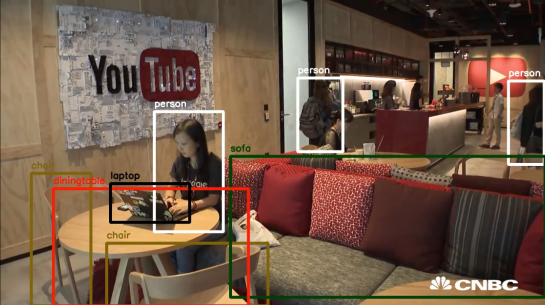

## Intro

Real-time object detection and classification. Paper: [version 1](https://arxiv.org/pdf/1506.02640.pdf), [version 2](https://arxiv.org/pdf/1612.08242.pdf).

Read more about YOLO (in darknet) and download weight files [here](http://pjreddie.com/darknet/yolo/). In case the weight file cannot be found, I uploaded some of mine [here](https://drive.google.com/drive/folders/0B1tW_VtY7onidEwyQ2FtQVplWEU), which include `yolo-full` and `yolo-tiny` of v1.0, `tiny-yolo-v1.1` of v1.1 and `yolo`, `tiny-yolo-voc` of v2.


Click on this image to see demo from yolov2:

[](http://i.imgur.com/EyZZKAA.gif)

## Dependencies

Python3, tensorflow 1.0, numpy, opencv 3.

### Getting started

There are three ways to get started with darkflow.

1. Just build the Cython extensions in place.
    ```
    python3 setup.py build_ext --inplace
    ```

2. Let pip install darkflow in dev mode (globally accessible but changes to the code immediately take effect)
    ```
    pip install -e .
    ```

3. Install with pip globally
    ```
    pip install .
    ```

## Update

**Android demo on Tensorflow's** [here](https://github.com/tensorflow/tensorflow/blob/master/tensorflow/examples/android/src/org/tensorflow/demo/TensorFlowYoloDetector.java)

**I am looking for help:**
 - `help wanted` labels in issue track

## Parsing the annotations

Skip this if you are not training or fine-tuning anything (you simply want to forward flow a trained net)

For example, if you want to work with only 3 classes `tvmonitor`, `person`, `pottedplant`; edit `labels.txt` as follows

```
tvmonitor
person
pottedplant
```

And that's it. `darkflow` will take care of the rest.

## Design the net

Skip this if you are working with one of the original configurations since they are already there. Otherwise, see the following example:

```python
...

[convolutional]
batch_normalize = 1
size = 3
stride = 1
pad = 1
activation = leaky

[maxpool]

[connected]
output = 4096
activation = linear

...
```

## Flowing the graph using `flow`

```bash
# Have a look at its options
./flow --h
```

First, let's take a closer look at one of a very useful option `--load`

```bash
# 1. Load yolo-tiny.weights
./flow --model cfg/yolo-tiny.cfg --load bin/yolo-tiny.weights

# 2. To completely initialize a model, leave the --load option
./flow --model cfg/yolo-new.cfg

# 3. It is useful to reuse the first identical layers of tiny for `yolo-new`
./flow --model cfg/yolo-new.cfg --load bin/yolo-tiny.weights
# this will print out which layers are reused, which are initialized
```

All input images from default folder `test/` are flowed through the net and predictions are put in `test/out/`. We can always specify more parameters for such forward passes, such as detection threshold, batch size, test folder, etc.

```bash
# Forward all images in test/ using tiny yolo and 100% GPU usage
./flow --test test/ --model cfg/yolo-tiny.cfg --load bin/yolo-tiny.weights --gpu 1.0
```
json output can be generated with descriptions of the pixel location of each bounding box and the pixel location. Each prediction is stored in the `test/out` folder by default. An example json array is shown below.
```bash
# Forward all images in test/ using tiny yolo and JSON output.
./flow --test test/ --model cfg/yolo-tiny.cfg --load bin/yolo-tiny.weights --json
```
JSON output:
```json
[{"label":"person", "confidence": 0.56, "topleft": {"x": 184, "y": 101}, "bottomright": {"x": 274, "y": 382}},
{"label": "dog", "confidence": 0.32, "topleft": {"x": 71, "y": 263}, "bottomright": {"x": 193, "y": 353}},
{"label": "horse", "confidence": 0.76, "topleft": {"x": 412, "y": 109}, "bottomright": {"x": 592,"y": 337}}]
```
 - label: self explanatory
 - confidence: somewhere between 0 and 1 (how confident yolo is about that detection)
 - topleft: pixel coordinate of top left corner of box.
 - bottomright: pixel coordinate of bottom right corner of box.

## Training new model

Training is simple as you only have to add option `--train`. Training set and annotation will be parsed if this is the first time a new configuration is trained. To point to training set and annotations, use option `--dataset` and `--annotation`. A few examples:

```bash
# Initialize yolo-new from yolo-tiny, then train the net on 100% GPU:
./flow --model cfg/yolo-new.cfg --load bin/yolo-tiny.weights --train --gpu 1.0

# Completely initialize yolo-new and train it with ADAM optimizer
./flow --model cfg/yolo-new.cfg --train --trainer adam
```

During training, the script will occasionally save intermediate results into Tensorflow checkpoints, stored in `ckpt/`. To resume to any checkpoint before performing training/testing, use `--load [checkpoint_num]` option, if `checkpoint_num < 0`, `darkflow` will load the most recent save by parsing `ckpt/checkpoint`.

```bash
# Resume the most recent checkpoint for training
./flow --train --model cfg/yolo-new.cfg --load -1

# Test with checkpoint at step 1500
./flow --model cfg/yolo-new.cfg --load 1500

# Fine tuning yolo-tiny from the original one
./flow --train --model cfg/yolo-tiny.cfg --load bin/yolo-tiny.weights
```

Example of training on Pascal VOC 2007:
```bash
# Download the Pascal VOC dataset:
curl -O https://pjreddie.com/media/files/VOCtest_06-Nov-2007.tar
tar xf VOCtest_06-Nov-2007.tar

# An example of the Pascal VOC annotation format:
vim VOCdevkit/VOC2007/Annotations/000001.xml

# Train the net on the Pascal dataset:
./flow --model cfg/yolo-new.cfg --train --dataset "~/VOCdevkit/VOC2007/JPEGImages" --annotation "~/VOCdevkit/VOC2007/Annotations"
```

## Camera/video file demo

For a demo that entirely runs on the CPU:

```bash
./flow --model cfg/yolo-new.cfg --load bin/yolo-new.weights --demo videofile.avi
```

For a demo that runs 100% on the GPU:

```bash
./flow --model cfg/yolo-new.cfg --load bin/yolo-new.weights --demo videofile.avi --gpu 1.0
```

To use your webcam/camera, simply replace `videofile.avi` with keyword `camera`.

To save a video with predicted bounding box, add `--saveVideo` option.

## Using darkflow from another python application

Please note that `return_predict(img)` must take an `numpy.ndarray`. Your image must be loaded beforehand and passed to `return_predict(img)`. Passing the file path won't work.

Result from `return_predict(img)` will be a list of dictionaries representing each detected object's values in the same format as the JSON output listed above.

```python
from darkflow.net.build import TFNet
import cv2

options = {"model": "cfg/yolo.cfg", "load": "bin/yolo.weights", "threshold": 0.1}

tfnet = TFNet(options)

imgcv = cv2.imread("./test/dog.jpg")
result = tfnet.return_predict(imgcv)
print(result)
```

## Migrating the graph to mobile devices (JAVA / C++ / Objective-C++)

```bash
## Saving the lastest checkpoint to protobuf file
./flow --model cfg/yolo-new.cfg --load -1 --savepb
```

The name of input tensor and output tensor are respectively `'input'` and `'output'`. For further usage of this protobuf file, please refer to the official documentation of `Tensorflow` on C++ API [_here_](https://www.tensorflow.org/versions/r0.9/api_docs/cc/index.html). To run it on, say, iOS application, simply add the file to Bundle Resources and update the path to this file inside source code.

That's all.
